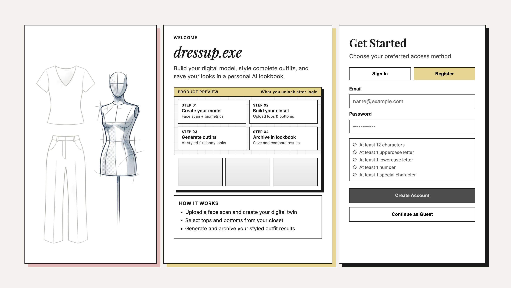

# dressup.exe - AI Virtual Styling Platform

dressup.exe is a full-stack AI fashion application that turns a face scan into a personalized digital model, combines selected wardrobe pieces into generated outfit renders, and manages a visual archive of created looks.



The project combines:

- AI image generation workflows
- a Python + FastAPI backend with persistent closet data (SQLite)
- a JavaScript + React + Vite frontend with a custom brutalist-inspired UI

---

## Highlights

- **Secure Authentication** (email/password) with modern password policy
- **Guest Mode** with isolated one-session data behavior
- **Account-Scoped Data Isolation** for closet, lookbook, avatar, and profile state
- **AI Avatar Generation** from biometric input (height, weight, body type, gender, face scan)
- **AI Outfit Try-On** by compositing avatar + top + bottom references
- **Digital Closet Management** (upload, categorize, browse, delete)
- **Lookbook Archive** for generated outfits with delete flow
- **Strict Portrait Framing Pipeline** (9:16 / 1080x1920) with full-body validation retries
- **Profile Avatar UX**: circle profile image in header (from uploaded face scan) with Wardrobe dropdown menu for logout

---

## Tech Stack

### Frontend (JavaScript)

- React 19
- React Router
- Vite
- CSS Modules + custom styling

### Backend (Python)

- FastAPI
- SQLAlchemy
- SQLite
- Pillow (image pre/post-processing)
- Google Gemini API (`gemini-2.5-flash-image`, `gemini-2.5-flash`)

---

## Project Structure

frontend/

- JavaScript React application (Wardrobe, Closet, Avatar, Gallery, About)

backend/

- Python FastAPI routes and AI service orchestration
- `uploads/` static file storage

database/

- SQLite database file (`closet.db`)

---

## Core User Flows

1. **Create model** in the Avatar page using biometric data + face scan.
2. **Upload clothing items** to categorized closet sections.
3. **Select top and bottom** in Wardrobe and run AI try-on.
4. **Save / archive generated looks** and review them in Lookbook.
5. **Manage archive** with in-app delete confirmation UI.

---

## Local Development Setup

### 1) Clone

```bash
git clone https://github.com/Sissighn/dressup-exe.git
cd dressup-exe
```

### 2) Backend setup

```bash
cd backend
python -m venv venv
source venv/bin/activate

pip install fastapi uvicorn sqlalchemy python-dotenv pillow python-multipart google-genai
```

### 3) Environment variables

Create a `.env` file in `backend/`:

```bash
GOOGLE_API_KEY=your_google_ai_key_here
AUTH_SECRET_KEY=your_long_random_secret_here
```

`AUTH_SECRET_KEY` should be a long random secret (high entropy), unique per environment.

### 4) Run backend

```bash
uvicorn main:app --reload --port 8000
```

### 5) Run frontend (new terminal)

```bash
cd frontend
npm install
npm run dev

Frontend: http://localhost:5173
Backend: http://localhost:8000
```

---

## API Overview

### Authentication & Profile

- `POST /auth/register` — register with email/password
- `POST /auth/login` — login with email/password
- `POST /auth/guest` — start isolated guest session
- `GET /auth/me` — validate current token/session
- `GET /profile` — get persisted user profile (avatar + biometrics)
- `PUT /profile` — update persisted user profile

### Core Features

- `POST /generate-avatar` — generate avatar from biometrics + face scan
- `POST /try-on-outfit` — generate try-on image from avatar/top/bottom
- `POST /upload-item` — upload and save closet item metadata
- `GET /closet` — list closet items
- `DELETE /delete-item/{item_id}` — remove closet item and image file
- `POST /archive-look` — archive generated look image
- `GET /gallery` — list archived looks
- `DELETE /delete-look/{filename}` — remove archived look
- `GET /providers/check` — check configured AI provider status

---

## Design Notes

The interface intentionally uses a bold editorial/brutalist aesthetic:

- high-contrast borders
- mono + serif typography pairing
- card-based visual hierarchy
- strong micro-interactions for action states

This design direction supports portfolio storytelling while keeping usability clear.

---

## Current Status

This project is actively evolving with iterative UX refinements and feature hardening.

Planned improvements include:

- cloud storage for assets
- CI/CD deployment pipeline
- automated tests (frontend + backend)

---

## License

MIT License © 2026 Setayesh Golshan
