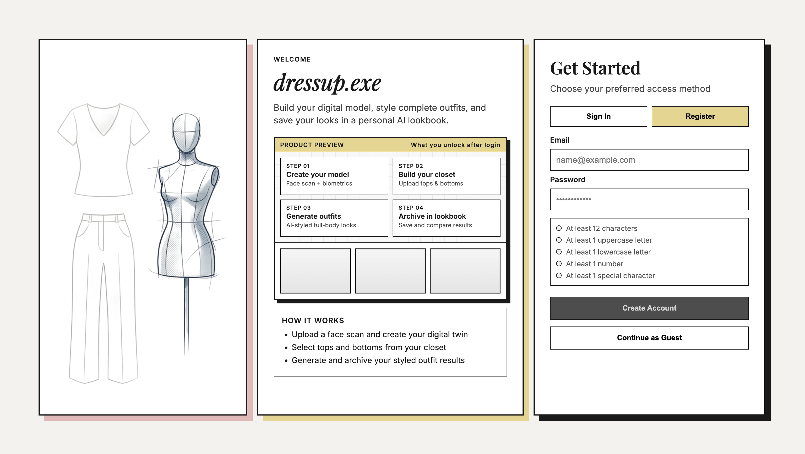

# dressup.exe — AI Virtual Styling Platform

[](https://github.com/Sissighn/dressup-exe/actions/workflows/ci.yml)
[](LICENSE)


dressup.exe turns a face scan into a personalized digital model, combines selected
wardrobe pieces into generated outfit renders, and keeps a visual archive of the
looks you create.

It runs three ways: as a local development stack, via Docker Compose, or as an
installable macOS app that bundles its own Python runtime.



---

## Features

- **Email/password authentication** with a modern password policy
- **HttpOnly cookie sessions** with validated JWT claims (`iss`, `aud`, `iat`, `jti`)
- **Guest mode** with data isolated to a single session
- **Account-scoped data** for closet, lookbook, avatar, and profile state
- **Protected upload delivery** — private assets are served through an
  authenticated route with ownership checks, not as public static files
- **Rate limiting** on auth, uploads, and both generation endpoints
- **AI avatar generation** from biometric input (height, weight, body type,
  gender, face scan)
- **AI outfit try-on** — avatar + top + bottom, or avatar + a one-piece dress
- **Digital closet** with upload, automatic background removal, categories, and delete
- **Lookbook and styling boards** to archive and revisit generated outfits
- **Strict portrait framing pipeline** (9:16, 1080×1920) with full-body validation retries

---

## Install the macOS app

Prebuilt releases are on the
[Releases page](https://github.com/Sissighn/dressup-exe/releases/latest).
Nothing else needs to be installed — the app ships its own Python runtime, so no
Python, Node, or Docker is required.

1. Download `dressup.exe-<version>-arm64.dmg` (Apple Silicon).
2. Open the DMG and drag **dressup.exe** into *Applications*.
3. The build is ad-hoc signed but not notarized, so macOS blocks the first
   launch. Right-click the app → **Open** → *Open*. Only needed once.
4. On first start the app asks for a **Google AI API key**. Get one for free at
   [aistudio.google.com/apikey](https://aistudio.google.com/apikey). The key is
   stored locally with `0600` permissions and can be changed later via
   *dressup.exe → Google-API-Key ändern…*.
5. Register an account, then: create your model on the **Avatar** page → upload
   clothes in **Closet** → pick a top and bottom (or a dress) in **Wardrobe** and
   generate.

Notes:

- Accounts are **local**. There is no cloud service behind the app — your data
  never leaves your Mac, and the same login on another machine starts empty.
- The first clothing upload downloads the background-removal model (~180 MB) and
  therefore needs an internet connection once.
- Without an API key the app still runs, but avatar and try-on generation stay
  unavailable.
- Your data lives in `~/Library/Application Support/dressup.exe/` — outside the
  app bundle, so reinstalling or updating the app does not touch it.
- The desktop wrapper (setup dialog, menu bar) is localized in German; the app
  itself is in English.

---

## Tech Stack

**Frontend** — React 19, React Router 7, Vite 7, custom CSS

**Backend** — FastAPI, SQLAlchemy 2, SQLite, Alembic migrations, PyJWT,
Pillow, rembg, Google Gemini API (`gemini-2.5-flash-image`, `gemini-2.5-flash`)

**Packaging** — Docker Compose with an Nginx container for the production build,
Electron + electron-builder for the macOS app

---

## Project Structure

```
backend/     FastAPI app split into routers, schemas, security, storage, services
             Alembic migrations, protected uploads/ storage
frontend/    React application (Auth, Avatar, Closet, Wardrobe, Gallery, About)
database/    SQLite database file (closet.db)
desktop/     Electron wrapper that packages backend, frontend, and a bundled
             Python runtime into an installable macOS app
docs/        Screenshots
```

---

## Development Setup

Requirements: **Python 3.11**, **Node 22**, and a Google AI API key.

### 1. Clone

```bash
git clone https://github.com/Sissighn/dressup-exe.git
cd dressup-exe
```

### 2. Backend

```bash
cd backend
python3.11 -m venv venv
source venv/bin/activate
pip install -r requirements.txt
```

### 3. Environment variables

Create `backend/.env` (see `backend/.env.example`):

```bash
GOOGLE_API_KEY=your_google_ai_key_here
AUTH_SECRET_KEY=your_long_random_secret_here
AUTH_TOKEN_ISSUER=dressup-exe-api
AUTH_TOKEN_AUDIENCE=dressup-exe-client
AUTH_COOKIE_SECURE=false
AUTH_COOKIE_SAMESITE=lax
MAX_UPLOAD_BYTES=10485760
MAX_UPLOAD_PIXELS=24000000
DATABASE_URL=sqlite:///../database/closet.db
UPLOAD_DIR=uploads
APP_BASE_URL=http://localhost:8000
PUBLIC_ASSET_BASE_URL=http://localhost:8000
CORS_ALLOWED_ORIGINS=http://localhost:5173,http://127.0.0.1:5173,http://localhost:3000
```

`AUTH_SECRET_KEY` is required, must be at least 32 characters of high-entropy
random data, and must be unique per environment. Generate one with
`python -c "import secrets; print(secrets.token_urlsafe(48))"`. For production
over HTTPS, set `AUTH_COOKIE_SECURE=true`.

Optional Vite variables go in `frontend/.env`:

```bash
VITE_API_BASE_URL=http://localhost:8000
```

### 4. Run

```bash
# terminal 1
cd backend
alembic -c alembic.ini upgrade head
uvicorn main:app --reload --port 8000

# terminal 2
cd frontend
npm install
npm run dev
```

Frontend on `http://localhost:5173`, backend on `http://localhost:8000`.

### Docker

```bash
docker compose up --build
```

Same URLs. Compose runs the Alembic migrations before starting the API, persists
generated assets in `backend/uploads/`, and the SQLite database in `database/`.

---

## Building the macOS App

```bash
cd desktop
npm install
npm run dist
```

The result is `desktop/release/dressup.exe-<version>-arm64.dmg`.

How the packaged app differs from the development setup:

- Electron starts the backend on a free localhost port and waits for `/healthz`.
- The backend serves the production frontend build from that same port, so auth
  cookies and the protected `/uploads` route work without CORS.
- Upload URLs are stored relative (`PUBLIC_ASSET_BASE_URL=""`), which keeps saved
  images valid across restarts on different ports.
- Database, uploads, the generated `AUTH_SECRET_KEY`, the API key, and the backend
  log live in `~/Library/Application Support/dressup.exe/`.

Build details and the resource layout are documented in
[desktop/README.md](desktop/README.md).

---

## Tests

Backend — pytest with FastAPI `TestClient`, temporary SQLite storage, and mocked
AI/background-removal boundaries:

```bash
cd backend
python -m pytest -q --cov=. --cov-report=term-missing
```

Frontend — Vitest + React Testing Library:

```bash
cd frontend
npm run lint
npm run test
npm run build
```

End-to-end — a Playwright happy path against a mocked backend, covering guest
login, avatar creation, closet upload, outfit generation, and archive:

```bash
cd frontend
npx playwright install chromium
npm run e2e
```

GitHub Actions runs all of the above on every push and pull request, plus a
production dependency audit and Gitleaks secret scanning. The backend suite is
gated at 65% coverage.

---

## Security Notes

- Authentication uses HttpOnly cookies and JWT validation with issuer, audience,
  issued-at, expiry, and token-ID claims.
- `AUTH_SECRET_KEY` is required and must be unique per environment; the backend
  refuses to start if it is missing, shorter than 32 characters, or still set to
  a known placeholder value.
- Uploads are validated by extension, MIME type, file size, pixel count, and
  actual image parsing with Pillow.
- Generated assets are served through an authenticated `/uploads/{filename}`
  route with per-account ownership checks.
- Rate limiting on sensitive routes is in-memory and therefore per-process — it
  suits local and single-instance deployments, not a horizontally scaled setup.

---

## API Overview

### Authentication & Profile

| Method | Route | Purpose |
| --- | --- | --- |
| `POST` | `/auth/register` | Register with email and password |
| `POST` | `/auth/login` | Log in with email and password |
| `POST` | `/auth/guest` | Start an isolated guest session |
| `POST` | `/auth/logout` | Clear the session cookie |
| `GET` | `/auth/me` | Validate the current session |
| `GET` | `/profile` | Read the persisted profile (avatar + biometrics) |
| `PUT` | `/profile` | Update the persisted profile |

### Generation

| Method | Route | Purpose |
| --- | --- | --- |
| `POST` | `/generate-avatar` | Generate an avatar from biometrics + face scan |
| `POST` | `/try-on-outfit` | Try-on from avatar + `top_image`/`bottom_image`, or avatar + `dress_image` (exactly one of the two combinations) |
| `GET` | `/providers/check` | Report configured AI provider status |

### Closet & Archive

| Method | Route | Purpose |
| --- | --- | --- |
| `POST` | `/upload-item` | Upload a clothing item and store its metadata |
| `GET` | `/closet` | List closet items |
| `DELETE` | `/delete-item/{item_id}` | Remove an item and its image file |
| `POST` | `/export-styling-board` | Render selected items into a styling board |
| `POST` | `/archive-look` | Archive a generated look |
| `POST` | `/archive-board` | Archive a styling board |
| `GET` | `/gallery` | List archived looks |
| `GET` | `/boards` | List archived styling boards |
| `DELETE` | `/delete-look/{filename}` | Remove an archived look |
| `DELETE` | `/delete-board/{filename}` | Remove an archived board |
| `GET` | `/uploads/{filename}` | Authenticated asset delivery |
| `GET` | `/healthz` | Health check |

---

## Design

The interface uses a deliberately bold editorial/brutalist aesthetic: high
contrast borders, a mono and serif type pairing, card-based hierarchy, and
pronounced micro-interactions on action states. The goal is a styling tool that
reads as a design object rather than a form.

---

## Roadmap

- Cloud storage for generated assets
- Notarized macOS builds and an Intel/universal target
- Deployment pipeline for a hosted instance

---

## License

MIT — see [LICENSE](LICENSE). © 2026 Setayesh Golshan
